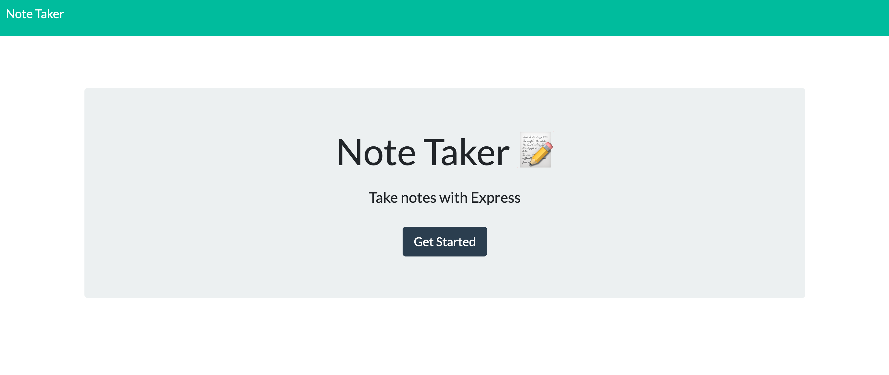
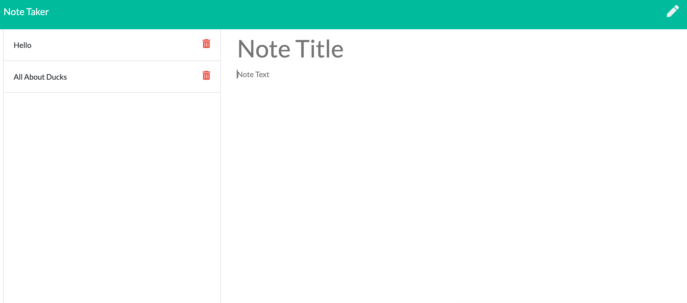

# Express Homework: Note_Taker

Creates an application that can be used to write, save, and delete notes. This application uses an express backend and saves and retrieves note data from a JSON file.
For users that need to keep track of a lot of information, it's easy to forget or be unable to recall something important. Being able to take persistent notes allows users to have written information available when needed.

## Deploying the App

[Deployed on Heroku](https://ancient-depths-17492.herokuapp.com/)

## Preview the App

